# 跨帧同位置参考：浆纱机筘齿区深色纱缺陷检测

> 冻结 DINOv2 多层 patch 特征 + **固定机位跨帧同位置参考**。
> **零训练、零缺陷样本、不使用任何标签。**
> 黑纱基准（69 帧 / 16 缺陷）：图级 AUROC **98.2** · AP **93.7** · 定位 **15/16** · PRO **76.3**；
> 用纯正常帧定阈时 召回 **93.8%** / 精确率 **83.3%**。
> 标准 IAD 基线（PaDiM / PatchCore / SimpleNet）同口径对比：它们能定位（12~14/16），但用正常帧定阈时召回仅 6%；本方法 93.8%。

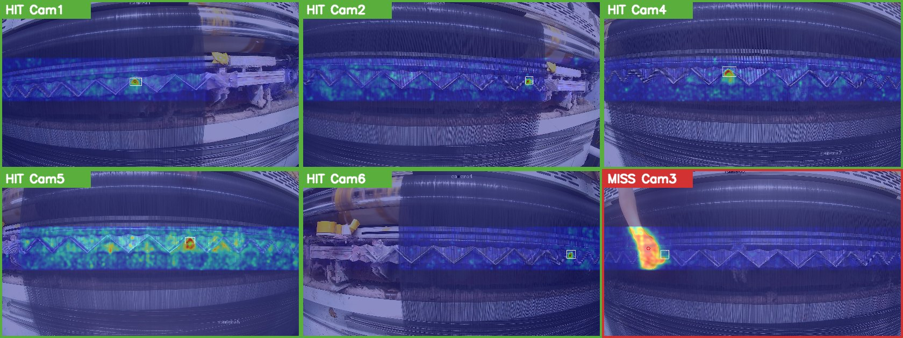

*热图 = 异常度，白框 = 人工标注真缺陷，圆点 = 预测位置（绿 = 命中 / 红 = 未命中）。
右下 Cam3 是唯一漏检：工人手臂伸入画面，异常度被人手主导，峰值离开了缺陷区——
这正是本方法的失效模式，详见[方法说明 §6](docs/方法说明.md)。*

---

## 一、为什么要这么做

织造深色/黑纱时，筘齿区缺陷的形态是**筘齿锯齿被絮状物糊住**（不是暗块也不是断线），
缺陷区约 110×100 px，占 1920×1080 整幅的 **0.2%**。

难点不是"小"，而是**没有监督信号**：

- 工厂只积累到 **16 个**黑纱缺陷实例，且这批数据被锁为测试集禁训；
- 白纱模型迁到黑纱后 detect 召回 **0**（`data/benchmark_scores.csv`）；
- 更根本的是：诊断表明缺陷区与**同一张图内**的正常区在低层特征（亮度、对比度、锐度、
  高频能量、周期强度、Michelson 对比度）上**完全不可分**，平均 |z| 全部 < 1.0。

最后一条是决定性的——**任何"看单张图找异常"的判据在黑纱上注定失败**。
要检测，必须引入图外的参考系。

工业相机是**固定机位**的。于是把问题改写成一个无歧义的形式：

> **这个位置，在该机位的其他时刻，有没有任何一帧长得像现在这样？**

没有 → 异常。这个判据**对颜色天然免疫**（参考帧与当前帧纱色相同，颜色在比对中抵消），
所以不需要改色增广、不需要域适应，也不需要一张缺陷样本。

---

## 二、方法

```
输入帧
  ├─① 裁筘齿带 y ∈ [0.34, 0.60]×H，缩放到固定带高 448
  ├─② 带内切重叠 tile (588×448, overlap 140) → DINOv2 ViT-B/14
  │     取最后 8 层 patch token 拼接（多层是主要增益）→ L2 归一化
  ├─③ 参考 = 同相机其他帧的**同一 patch 坐标**特征，余弦相似度取 top-1
  │     逐 patch 异常度 = 1 − top1_similarity
  └─④ P99 二值化 → 连通域；图级分数 = 面积 ≤ 55 patch 的最大连通域面积
        定位 = 该连通域重心
```

四个关键设计（增益均为实测，详见 [docs/方法说明.md](docs/方法说明.md)）：

| 设计 | 增益 |
|---|---|
| 图级分数用**连通域面积**而非 max | AUROC 81 → 96.4，且让"纯正常样本定阈"从不可行变为可行 |
| 参考取 **top-1** 而非 top-3 | 产线定阈召回 75% → 94% |
| 异常块**面积上限 55 patch**（滤人手入侵） | AUROC 96.4 → 98.2 |
| 定阈用**中位数 + 3.5×MAD** 而非 P95 | 参考池被缺陷污染时阈值不再虚高 5~10 倍 |

---

## 三、实验结果

**数据集**：`D:/dataset/black_fabric`，6 机位，去重后 **69 帧**：**16 帧含真缺陷（16 个实例）**、
53 帧正常。永久锁为测试集禁训。

> 目录里原有 71 张，其中 2 张是字节级完全相同的 " - 副本" 复制件（Cam3、Cam6 各 1，均为正常帧）。
> 重复帧互为完美参考，会把这两张正常帧的分数压到 0、虚高 AUROC 并压低误报率，
> 因此评估时由 `dedup_recs()` 剔除。去重前后差异：FPR@TPR100% 7.3→7.5、像素 AUROC 91.3→90.8、PRO 76.8→76.3，其余不变。

全部指标由 `src/metrics_full.py` 一次跑出，原始结果 `data/metrics_黑纱基准.json`。

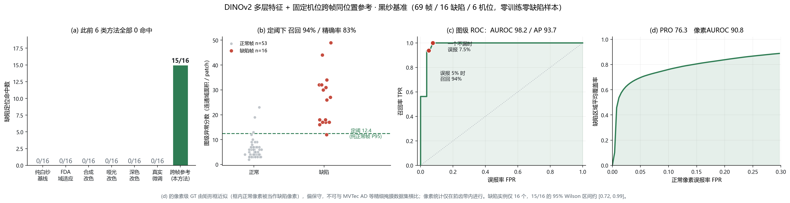

### 3.1 图级（这一帧有没有缺陷）

| 指标 | 数值 | 说明 |
|---|---|---|
| **AUROC** | **98.2** | 与阈值无关，可跨方法横比 |
| **AP (AUPR)** | **93.7** | PR 曲线下面积；正负不平衡时比 AUROC 敏感 |
| F1-max | 90.9 | **乐观上限**——最优阈值是在测试集上选的，不可当部署性能 |
| **产线定阈**（纯正常帧 P95 = 12.4） | 召回 **93.8%** · 精确率 **83.3%** · F1 **88.2** | **这一行才是真实性能**：阈值只用正常帧定，完全没看缺陷帧 |
| TPR@FPR=5% | 93.8% | 误报压到 5% 时还能抓住多少 |
| FPR@TPR=100% | 7.5% | 一个都不漏时要承受的误报率 |

### 3.2 定位（缺陷在哪里）

| 指标 | 数值 | 说明 |
|---|---|---|
| **点命中率** | **15/16 = 93.8%** | 异常连通域**重心**落在 GT 框内 |
| 像素级 AUROC | 90.8 | **框掩膜近似**，仅筘齿带内统计（见下注） |
| **PRO** (FPR ≤ 0.3) | **76.3** | 每个缺陷区域等权，不被大缺陷主导 |
| 框 IoU 中位数 | 0.508 | 输出的是异常区域外接框，非训练过的回归框 |
| 框级召回 @IoU≥0.1 / 0.3 / 0.5 | 93.8% / 87.5% / 56.2% | 低 IoU 阈值更贴近"报警框有没有套住缺陷" |

> **像素级指标口径**：本基准 GT 是**矩形框**而非精细掩膜，框内的正常像素被当成了缺陷像素，
> 所以像素 AUROC 与 PRO **偏保守**，**不能与 MVTec AD 等横比**。
> 且统计**只在筘齿带内**进行——检测器带外恒为 0，把带外像素计进去会把指标无意义地推高。

每个指标为什么要报、审稿人会怎么看，见 [docs/评测指标说明.md](docs/评测指标说明.md)。

### 3.3 与文献标准基线（SOTA）对比

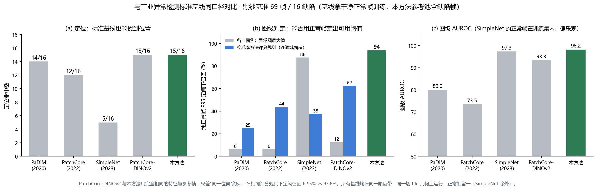

| 方法 | 定位命中 | 图级 AUROC | 产线定阈召回 (P95) | 一个不漏时误报 |
|---|---:|---:|---:|---:|
| PaDiM (2020) | 14/16 | 80.0 | 6.2% | 60.4% |
| PatchCore (2022) | 12/16 | 73.5 | 6.2% | 83.0% |
| SimpleNet (2023) ⚠ | 5/16 | 97.3 | 87.5% | 20.8% |
| PatchCore-DINOv2（同特征，无同位置约束） | 15/16 | 93.3 | 12.5% | 11.3% |
| PaDiM + 本方法评分规则 | 14/16 | 87.6 | 25.0% | 41.5% |
| PatchCore + 本方法评分规则 | 13/16 | 86.6 | 43.8% | 73.6% |
| SimpleNet + 本方法评分规则 | 5/16 | 73.9 | 37.5% | 79.2% |
| PatchCore-DINOv2 + 本方法评分规则 | 15/16 | 92.5 | 62.5% | 75.5% |
| **跨帧同位置参考（本方法）** | **15/16** | **98.2** | **93.8%** | **7.5%** |

协议：输入与本方法完全相同（同一筘齿带、同一切 tile 几何）；按机位独立，基线训练集 = 该机位**全部正常帧**（干净），
本方法参考池 = 其他全部帧（含缺陷帧，更难）；PaDiM / PatchCore / PatchCore-DINOv2 对正常帧留一；
⚠ SimpleNet 需训练，其正常帧同时在训练集与测试集，AUROC 偏乐观。复现：`src/sota_baselines.py`，原始数据 `data/sota_baselines.csv`。

三条结论：
1. **定位不是分水岭**——PaDiM 14/16、PatchCore 12/16，标准基线在这个协议下能找到缺陷位置。此前文档里"PatchCore 0/16"来自另一份数据、整图缩放的旧协议，**已更正**。
2. **分水岭是图级判定**：只用正常帧定阈时，基线召回 6%（PaDiM/PatchCore），本方法 93.8%。黑纱上正常帧的噪声峰与缺陷峰同量级，取最大值分不开。
3. **优势不只来自评分规则**：把本方法的连通域面积评分套到基线的异常图上，PaDiM 6→25%、PatchCore 6→44%、PatchCore-DINOv2 12.5→62.5%——有提升但都到不了 93.8%。
   PatchCore-DINOv2 与本方法特征相同、参考帧相同、评分规则相同，只差"同一位置"约束：**62.5% vs 93.8%**，这是"参考系选择 > 特征强弱"最干净的证据。

另有一组同样在本基准上 0/16 的自建尝试：纯白纱 YOLOv8 基线、FDA 域适应、三种合成改色、真实黑纱微调、GLASS（AUROC 58）、
structure-tensor 方向一致性、周期塌陷法、同相位周期比对、**DINOv2 同图 k-NN**（`data/benchmark_scores.csv`）。

### 3.4 消融

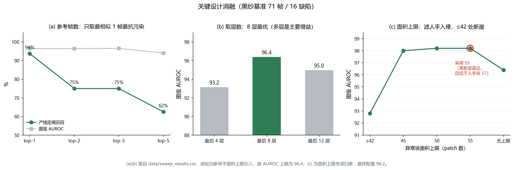

`data/sweep_results.csv` 是完整扫参记录。注意该轮扫参**早于面积上限引入**，
所以其中 AUROC 上限为 96.4；面积上限是后续专项扫的，最终配置 98.2。

### 3.5 机理量化：同位置参考为什么强（2026-09-11）

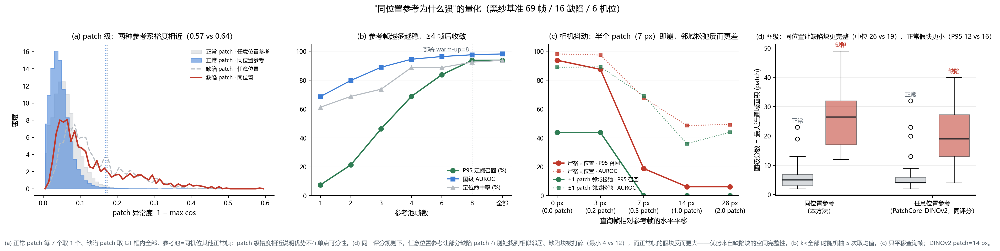

四个实验（`src/mech_exp.py`，原始数据 `data/mech_results_black.json`），**结论比预想的更有意思——起作用的不是 patch 级可分性，而是缺陷块的空间完整性**：

**(a) patch 级：两种参考系的可分裕度相近。** 正常 patch 异常度（1 − max cos）P99：同位置 0.169 vs 任意位置 0.173；
缺陷 patch 中位数 0.097 vs 0.112；"缺陷中位 / 正常 P99" 裕度 0.57 vs 0.64。
**原先"同位置把正常分布压窄"的假设在 patch 级上不成立**（同位置的正常中位数确实更低，0.041 vs 0.055，但尾部一样）。

**(d) 图级：差别出现在连通域。** 同一评分规则（P99 → 连通域面积）下，缺陷帧分数中位 26.5 vs 19、最小 12 vs 4；正常帧假块 P95 12.4 vs 15.8。
任意位置参考让缺陷块里的一部分 patch 在别处找到相似邻居、**把缺陷块打碎**，同时正常帧里"全带都不像"的区域反而连成假块。
同位置约束保住了缺陷块的空间完整性——这才是 93.8% vs 62.5% 的来源。

**(b) 参考帧数曲线：8 帧即饱和。** 1 帧参考（帧差式）定阈召回只有 7%，4 帧 69%，8 帧 94% 与全部帧持平——部署里 warm-up=8 这个经验值现在有曲线支撑。

| 参考帧数 | 1 | 2 | 3 | 4 | 6 | 8 | 全部 |
|---|---:|---:|---:|---:|---:|---:|---:|
| 定位命中 | 9.8/16 | 11.0/16 | 11.8/16 | 14.2/16 | 14.2/16 | 14.8/16 | 15.0/16 |
| 图级 AUROC | 68.7 | 79.8 | 89.0 | 94.5 | 96.4 | 97.6 | 98.2 |
| P95 定阈召回 | 7% | 21% | 46% | 69% | 84% | 94% | 94% |

**(c) 相机抖动：半个 patch 即崩，邻域松弛无效。** 只平移查询帧，7 px（0.5 patch）时定位 15→10/16、召回 94→19%；14 px 起完全失效。
±1 patch 邻域取最大相似度**反而更差**（0 px 时召回 94→44%）：邻域放宽让所有 patch 都更容易找到相似参考，缺陷信号被一起抹平。
**结论：本方法要求相机稳定在约 3 px（0.2 patch）以内；抖动需靠配准（registration）解决，不能靠松弛匹配。** 这是一条明确的适用条件，也是一条负结果。

| 查询帧平移 | 0 px | 3 px (0.2 patch) | 7 px (0.5 patch) | 14 px (1 patch) | 28 px (2 patch) |
|---|---:|---:|---:|---:|---:|
| 严格同位置 · 定位 / 召回 | 15/16 · 94% | 15/16 · 88% | 10/16 · 19% | 1/16 · 6% | 1/16 · 6% |
| ±1 patch 邻域松弛 · 定位 / 召回 | 15/16 · 44% | 15/16 · 44% | 11/16 · 0% | 4/16 · 0% | 0/16 · 0% |

**白纱回归**（27 帧带机位时间戳的正常帧，6 机位，带 y∈[0.36, 0.62]）：图级分数中位 3、最大 13（黑纱阈值 12.4 下 1/27 帧误报）；
同位置正常异常度中位 0.022 vs 任意位置 0.075——白纱上同位置的"正常"确实更窄。
白纱带机位信息且有缺陷标注的帧目前不存在（3690 张训练图重命名时丢了机位），所以白纱只能做误报与分布回归，不能算召回。

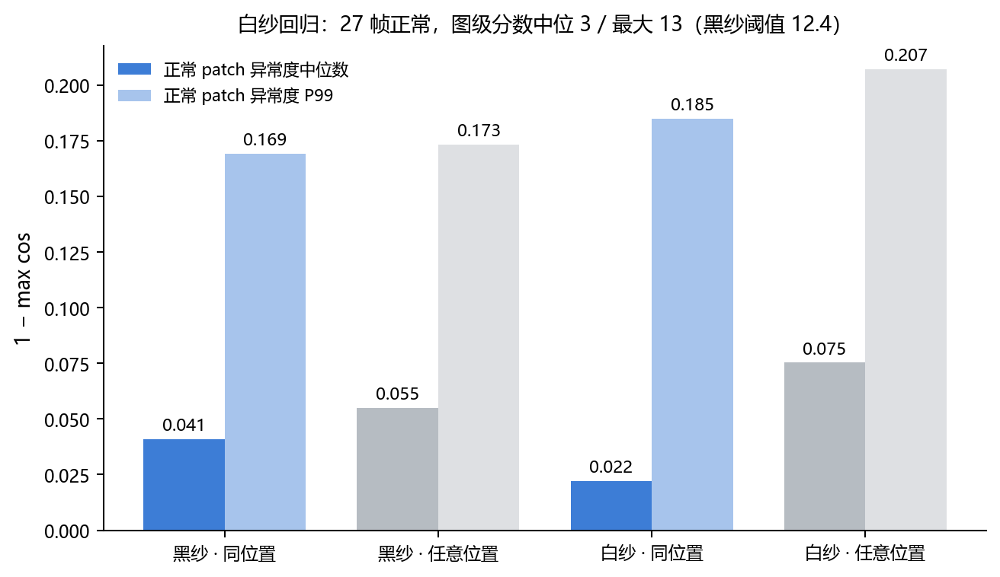

### 3.6 定阈：从"中位数+3.5MAD"到有统计保证的规则（2026-09-12）

现行的 `中位数 + 3.5×MAD` 与 `P95` 给出的误报率都是**经验值，没有保证**——无法回答"一个班次会被叫几次"。
本节把它换成两条只用正常帧、且误报率有数学保证的规则，并量化代价。
脚本 `src/p1_threshold_guarantee.py`、`p1_variants.py`；结论见 [docs/定阈实验结论.md](docs/定阈实验结论.md)。

- **保形 p 值**（conformal，Bates 等，*Ann. Statist.* 2023）：`p(s) = (1 + #{校准分 ≥ s}) / (n+1)`，`p ≤ α` 报警。
  只要校准帧与测试帧可交换，`P(误报) ≤ α` 严格成立。n 帧校准的**最小可声明** `α = 1/(n+1)`。
- **极值理论 POT**（Siffer 等，KDD 2017）：对校准分数超过 70 分位的尾部拟合广义帕累托分布再外推到目标风险 α。

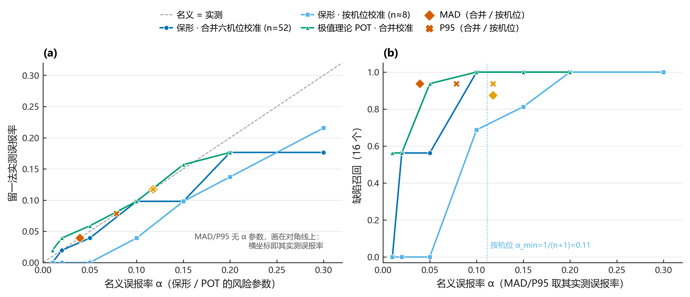

> **读表说明。**
> **校准方式** = 用哪些正常帧来定阈：`按机位` 每路相机只用自己的（≈8 帧，现行部署形态）；`合并` 六路的正常帧合到一起（52 帧）。
> **α** = 你想声明的目标误报率，只有保形与 POT 有这个参数，MAD 与 P95 没有（所以标"—"）。
> **留一误报** = 对每个正常帧，把它自己从校准集剔除后再判，被误报的比例。这样避免"用自己校准自己"的乐观偏差。
> **召回** = 16 个缺陷帧里被检出的比例（校准集本就不含缺陷帧，故用全部正常帧定阈）。
> **阈值** = 该规则算出的图级分数门限；分数定义见下方"图级异常分数"。
> 完整定义见 [docs/评测指标说明.md §六](docs/评测指标说明.md)。

| 校准方式 | 规则 | α | 留一误报 | 召回 | 阈值 |
|---|---|---|---:|---:|---:|
| 按机位 n≈8 | MAD（现行部署） | — | 9.4% | 87.5% | 9.2 |
| 按机位 n≈8 | 保形 | ≤5% | **0（永不报警）** | **0** | — |
| 合并六机位 n=52 | MAD | — | 3.8% | 93.8% | 15.4 |
| 合并六机位 n=52 | P95 | — | 7.5% | 93.8% | 12.4 |
| 合并六机位 n=52 | 保形 | 5% | 3.8% | 56.2% | 19 |
| 合并六机位 n=52 | **POT** | **5%** | **5.7%** | **93.8%** | **12.9** |

**三条结论：**

1. **现行的"按机位 8 帧 + MAD"给不出 5% 的保证。** 保形理论下限 `1/(8+1) = 11%`。
   要在按机位模式下声明 5%，每机位至少 19 帧正常帧；声明 1%，99 帧。
2. **POT 是最实用的替代**：α 是可解释的风险参数，阈值 12.9 与现行 P95 的 12.4 几乎相同，召回不掉。
   它对尾部做参数化外推，不像保形那样被个别高分帧"卡阶梯"。
3. **样本量**（95% 置信的无分布上容忍界）：声明误报 ≤1% 需 299 帧正常，≤2% 需 149，≤5% 需 59，≤10% 需 29。
   本基准有 53 帧正常，**距离"能声明 5%"差 6 帧**。这条直接决定产线标定段该录多长。

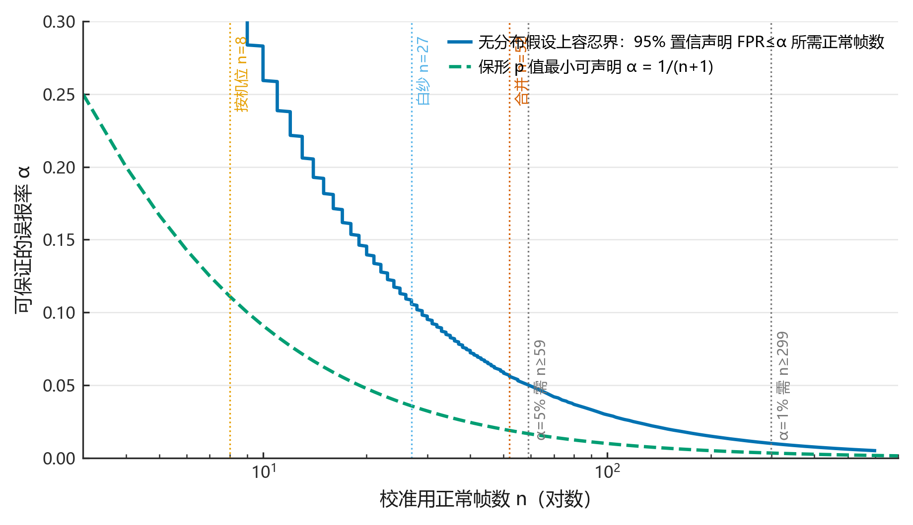

#### 保形 5% 的召回为什么只有 56%：追到了两帧

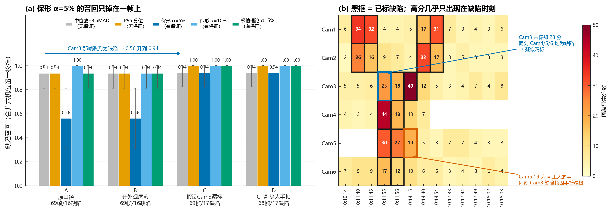

保形规则要求阈值高于校准集中除一帧外的全部分数，所以**单个高分帧就能顶死阈值**。追查后两帧都已定性：

- **Cam5 `10-14-15-402`（19 分）= 工人的手**（`assets/fig17_Cam5人手入侵.jpg`），属入侵物，不是纱线缺陷。
- **Cam3 `10-11-55-177`（23 分）疑似漏标**（`assets/fig16_Cam3疑似漏标.jpg`）：同一时刻 `10:11:55`，
  Cam4=44、Cam5=30、Cam6=17 三帧都已标缺陷，只有 Cam3 这帧没标；放大图可见 W 形筘齿中部有糊化暗斑。
  纱帘连续，同一次絮状物故障跨机位可见。**此帧待人工判读，本仓库不擅自改标注。**

> **读表说明。**表内数值均为**缺陷召回**（合并六机位、留一校准）。
> **口径** = 对这 69 帧的四种不同记法：`A` 按原标注；`B` 分数改用开启外观屏蔽后的值；
> `C` 假设 Cam3 那帧其实是缺陷（16→17 缺陷）；`D` 在 C 基础上再剔除那张拍到工人手的帧。
> **C 与 D 是假设性口径**，只用来量化"这两帧定性若改变，结论会变多少"，不作为成绩。

| 口径 | 帧数/缺陷 | MAD | P95 | 保形 5% | POT 5% |
|---|---|---:|---:|---:|---:|
| A 原口径 | 69 / 16 | 0.94 | 0.94 | **0.56** | 0.94 |
| B 开外观屏蔽 | 69 / 16 | 0.94 | 0.94 | **0.56** | 0.94 |
| C 假设 Cam3 漏标 | 69 / 17 | 0.94 | 1.00 | **0.94** | 1.00 |
| D C + 剔除人手帧 | 68 / 17 | 0.94 | 1.00 | **0.94** | 1.00 |

**若 Cam3 那帧确为缺陷，保形 5% 的召回从 0.56 升到 0.94，阈值从 19 降到 13——有统计保证的定阈几乎不损失召回。**
C 与 D 是假设性口径，用于量化定性改变的影响，不作为成绩。

**一条负面结果：外观屏蔽修不了定阈问题。**开启 `DET_INTRUDER_MASK` 后定位从 15/16 升到 16/16（与 §4.1 一致），
但 Cam5 那帧屏蔽掉 7.4% 带面积、分数仍是 19——手被盖住了，异常峰却落在手**旁边**未被盖住的区域；
更糟的是 Cam6 `10-14-15-407` 从 10 涨到 20，因为屏蔽把一个超过面积上限的大团切碎成了合规的小团。
**屏蔽是定位工具，不是定阈工具，两件事要分开讲。**

**跨机位同时性是可用信号**（图 12b）：高分几乎只出现在有缺陷的时刻，安静时段六个机位分数全在 3~8。
这既支持 Cam3 漏标的判断，也提示一个降误报手段——但需先确认它不会压掉真实的单机位局部缺陷。

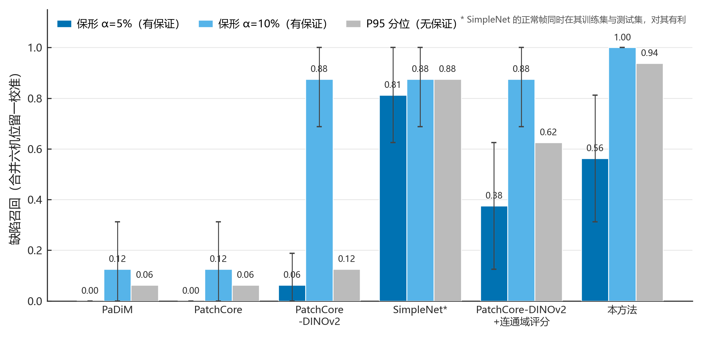

同一保形规则下的基线对比（合并留一校准）：α=10% 时本方法 100%、PatchCore-DINOv2 87.5%、PaDiM/PatchCore 12.5%；
α=5% 时本方法 56.2%、SimpleNet 81.2%（其正常帧同时在训练集与测试集，对其有利）。
**论文应两种口径并报**，不能只挑有利的那个。


#### 逐帧分数全表（69 帧，去重后）

> **读表说明。**
> **分数**（表内数字）= 图级异常分数，定义为：把 patch 级异常图按 P99 二值化后，
> 取所有连通域中面积 ≤55 patch 的**最大连通域面积**，单位是 patch 个数，是个整数。
> 它不是概率也不是距离。正常帧典型 2~9，缺陷帧典型 12~49。为什么用面积而不是最大值、为什么设 55 上限，见 §3.1 与指标说明 §11。
> **粗体** = 该帧已标注为缺陷。**括号内数字** = 开启外观屏蔽（`DET_INTRUDER_MASK=1`）后的分数，仅在与原值不同时显示。
> **—** = 该时刻该机位没有采到图。**时刻**取自文件名时间戳，同一时刻的六帧是六路相机同步拍的。


| 时刻 | Cam1 | Cam2 | Cam3 | Cam4 | Cam5 | Cam6 | 该时刻缺陷数 |
|---|---:|---:|---:|---:|---:|---:|---:|
| 10:10:14 | 6 | 2 | 5 | 4 | — | 7 | 0 |
| 10:11:40 | **34** | **26** | 5 | 3 | — | 9 | 2 |
| 10:11:45 | **32** | **16** | 6 | 4 | — | 9 | 2 |
| 10:11:55 | 4 | 9 | 23 | **44** | **30** | **17** | 3 |
| 10:11:56 | 4 | 7 | **18** | **18** | **27** | **12** | 4 |
| 10:14:15 | 5 | 4 | **49** (43) | 13 (12) | 19 | 10 (20) | 1 |
| 10:14:40 | **17** | **32** | 12 | 7 | 5 | 6 | 2 |
| 10:14:54 | **31** | **17** | 5 | — | 3 | 6 | 2 |
| 10:17:33 | 7 | 3 | 3 | — | 7 | 3 | 0 |
| 10:17:44 | 3 | 5 | 4 | — | 7 | 4 | 0 |
| 10:17:49 | 4 | 3 | 7 | — | 4 | 3 | 0 |
| 10:18:02 | 3 | 3 | — | — | 3 | 6 | 0 |
| 10:18:03 | 6 | 3 | 8 | — | 3 | — | 0 |

粗体 = 已标缺陷；括号内 = 开启外观屏蔽后的分数（仅在与原值不同时显示）。

下表是同一批分数的分布概览（单位同上，patch 个数）：

| | 缺陷帧 (16) | 正常帧 (53) |
|---|---|---|
| 最小 / 中位 / 最大 | 12 / 26 / 49 | 2 / 5 / 23 |
| P95 | 44 | 12 |

**这张表本身就说明三件事：**

1. **安静时段（10:17–10:18）六个机位分数全在 3~8**，而每个缺陷时刻都有机位冲到 16 以上。信噪比在图级是清楚的。
2. **缺陷是跨机位同时发生的**：10:11:55 与 10:11:56 各有 3~4 个机位同时报高分。
   纱帘连续，同一次絮状物故障多机位可见。这正是判断 Cam3 10:11:55 那帧疑似漏标的依据。
3. **外观屏蔽只改动了三帧**（括号内），且方向不一：Cam3 缺陷帧 49→43、Cam4 正常帧 13→12、
   Cam6 正常帧 **10→20**。它对定位有用（15/16→16/16），对图级分数是噪声。

---

### 3.7 颜色不是本方法的难点——与色纱路线的分工

跨帧参考在 **F1 真实工厂红纱**上失败（§四），当时怀疑过颜色因素。
色纱仓库用同一批 F1 数据、按 CIEDE2000 口径测得 **F1 到白纱的色差只有 8.2**
（ROI 里 C\* 仅 7.6，其实是极淡的粉），而五个颜色处理臂在它上面全都只有 0.31~0.44。
**F1 的失效与颜色无关**，根因就是 §四说的人手入侵与临时物件。

两条路线的分工与各自的失效维度，见 [Colored-Yarn-Research](https://github.com/JosephQ47/Colored-Yarn-Research)。
简言之：色纱路线的上限卡在**亮度**（颜色不变模型在 L\*=16.7 的目标色上只剩 0.00~0.36），
所以深色纱只能走本仓库这条跨帧参考的路，不能指望颜色处理。


---

## 四、方法的边界：红纱上失败了

同一套代码搬到 **F1 真实工厂红纱**（24 帧、单机位、16 缺陷实例 + 9 张确认正常）上失败：
**定位 3/15、图级 AUROC 67.0、P95 定阈召回 13% / 误报 11%**
（复现 `src/f1_crossframe_eval.py`，明细 `data/f1_crossframe_红纱负结果.json`）。

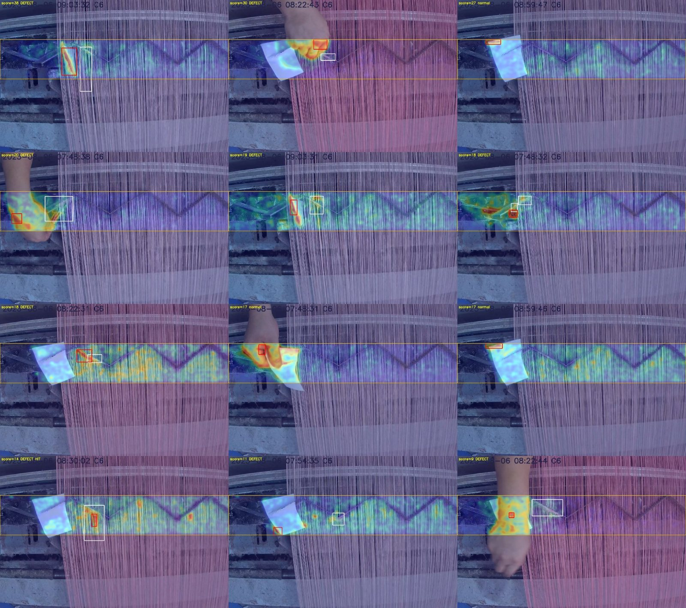

*F1 分数最高的 12 帧。异常热图几乎全部落在**工人的手**和**白纸卡**上——
这两样在帧间位置变化，跨帧比对时它们才是"最不像参考"的区域，真正的缺陷（白框）被淹没。*

失败原因**不是颜色**，而是本方法的三条前提被破坏：

1. **画面里有会动的东西**（人手、临时放置的白纸卡）；
2. **参考池重污染**：24 帧里 15 帧含缺陷（黑纱基准是 69 帧里 16 帧，正常帧占 77%）；
3. 面积上限 55 是在黑纱人手块（57 patch）上调的，换机位换视场后这个先验不迁移。

**结论：跨帧参考的有效性取决于采集纪律，而不是纱线颜色。**

### 4.1 修复：两处改动，F1 定位 3/15 → 10/15，黑纱 15/16 → 16/16

上面三条诊断逐个验证后（`src/f1_repair_exp.py` / `f1_repair_exp2.py`，
结果 `data/repair_round1_F1修复.csv` / `repair_round2_外观屏蔽.csv`，详见 [docs/修复实验结论.md](docs/修复实验结论.md)）：

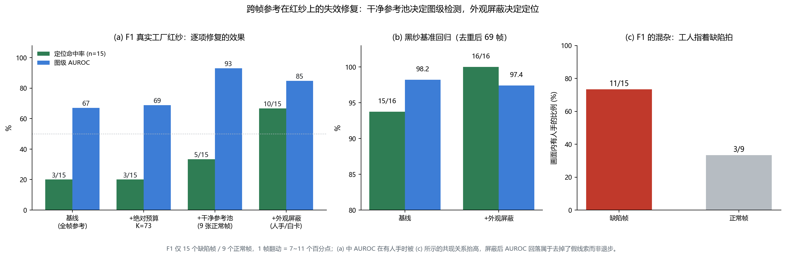

| 改动 | F1 定位 | F1 图级 AUROC | 黑纱定位 | 黑纱 AUROC |
|---|---:|---:|---:|---:|
| 基线 | 3/15 | 67.0 | 15/16 | 98.2 |
| 预算改绝对 K=73 | 3/15 | 68.9 | — | — |
| **+ 干净参考池**（只用 9 张确认正常帧） | 5/15 | **93.0** | — | — |
| **+ 外观屏蔽**（LAB 中值背景差分抓人手/白卡） | **10/15** | 84.8 | **16/16** | 97.4 |

- **干净参考池决定图级检测**：AUROC 67→93、P95 召回 13%→87%、"一个不漏"时误报 100%→11%。
  这正是产线"上线前先录一段正常运行做标定"的流程，所以修复可落地。
- **外观屏蔽决定定位**：人手要用外观（大面积、与背景 ΔE 大）去抓，而不是异常图面积——
  K=73 预算下人手块被切成多个 ≤55 的碎块，面积判据抓不住（R2/R4 无效）。
  换成 LAB 中值背景差分后 F1 定位翻倍，黑纱唯一漏检（Cam3 手臂）翻正为 **16/16**，召回/误报不变。
  两个域用**同一组事先固定的参数**（ΔE>20、面积>带 1.5%），没有在 F1 上扫参。
- **F1 数据带混杂：工人指着缺陷拍。** 15 张缺陷帧里 11 张有人手，9 张正常帧只有 3 张。
  屏蔽人手后 AUROC 从 93 回落到 85 **不是退步，是去掉了假线索**——此前一部分"检出"其实是在检人手。
  因此 F1 上只有定位命中（要求重心落进 GT 框）可信，图级指标不能作为方法有效的证据。

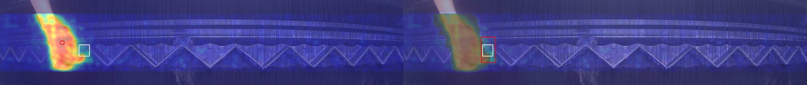

*黑纱基准唯一漏检帧（Cam3，手臂入侵）：左 = 修复前，异常峰值（红圈）落在手上；右 = 屏蔽人手（灰）后红框套住缺陷（白框）。*

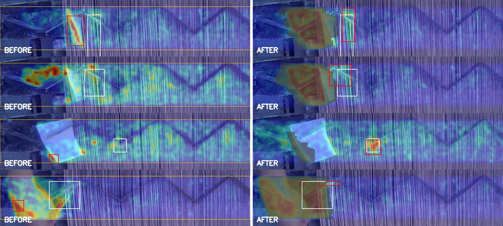

*F1 四帧修复前后：左列基线红框全在手/卡上，右列屏蔽人手后红框落回缺陷。*

外观屏蔽已作为**可选开关**并入 `black_yarn_detector.py` 与 `deploy_black_detector.py`
（环境变量 `DET_INTRUDER_MASK=1`，**默认关闭**，基准成绩不变）。没有设为默认、也没有移植到 C#，
是因为它把黑纱 AUROC 从 98.2 变成 97.4——16 个样本上分不出这是噪声还是代价，等 F2 第二测试集再定。
部署脚本开启后每路相机多缓存 8 帧筘齿带 LAB 缩略图（约 1 MB/帧），背景取其逐像素中值。

## 五、如何部署

### 5.1 三种运行形态

| 形态 | 脚本 | 参考帧来源 | 用途 |
|---|---|---|---|
| 基准评估 | `src/black_yarn_detector.py` | 同相机**全部**测试帧（留一法） | 论文/复现成绩 |
| 完整指标 | `src/metrics_full.py` | 同上 | 出图级 + 像素级 + PRO 全套指标 |
| **现场部署** | `src/deploy_black_detector.py` | 同相机**历史**帧滚动缓冲（因果） | 产线真实流程 |
| 产线集成 | `csharp/BlackYarnDetector.cs` | 同上 | 已集成进工厂 C# 系统 |

基准用留一法（transductive）是产线合法的——因为部署时同样只需要该机位的其他帧；
但为避免高估，部署脚本改成**只用历史帧**（因果），实测检出 15/16、误报 10%。

### 5.2 Python 侧

安装依赖：

```bash
pip install -r src/requirements.txt
```

在自己的帧目录上跑（**上线前先录一段确认正常的运行，用它标定**）：

```bash
python src/deploy_black_detector.py <帧目录> --calib-dir <确认正常的帧目录> --out <输出目录>
```

关键参数（环境变量覆盖，**改动须回基准复测**）：

| 变量 | 默认 | 含义 |
|---|---|---|
| `DET_LAYERS` | 8 | 取 DINOv2 最后 N 层拼接 |
| `DET_TOPK` | 1 | 参考帧取最相似 top-k |
| `DET_BUF` | 16 | 滚动缓冲帧数 |
| `DET_MIN_REF` | 8 | warm-up 最少参考帧（< 8 性能明显下降） |
| `DET_AREA_CAP` | 55 | 异常块面积上限（patch 数） |
| `DET_K_MAD` | 3.5 | 鲁棒定阈 中位数 + K×MAD |
| `DET_INTRUDER_MASK` | 0 | **=1 开启外观级入侵屏蔽**（人手/白卡，见 §4.1）。默认关：基准成绩不变；开启后黑纱 16/16、AUROC 97.4 |
| `DET_GATED` / `DET_GATE_MAX` | 0 / 30 | **=1 门控参考缓冲**：报警帧不入池，防持续缺陷被吸收；连续 GATE_MAX 帧被挡则放行 1 帧防漂移饿死。基准数据上与无门控判定完全相同（最长持续序列仅 2 帧，测不出长时吸收），默认关，见 `docs/修复实验结论.md` §七 |

输出：报警叠加图 + `alarms.jsonl`（含相机、分数、阈值、定位框）。

文件名需能解析相机标识（默认正则 `(Cam\d)`）与时间顺序，因为**参考池必须按相机分组**——
跨相机的同位置特征没有可比性。

### 5.3 产线 C# 侧

`csharp/BlackYarnDetector.cs`（.NET Framework 4.7.2 + OpenCvSharp + ONNX Runtime），
算法常量与 Python 一一对应，**同后端（均 CPU）下 32/32 帧分数与阈值完全一致**。
详见 [csharp/README.md](csharp/README.md) 与 [docs/现场部署手册.md](docs/现场部署手册.md)。

需要的 `dinov2_vitb14_l8_448x588.onnx`（约 330 MB）超出 GitHub 单文件限制，未入库，
用仓库脚本自行导出：

```bash
python src/export_dinov2_onnx.py
```

导出后用 `src/verify_onnx_pipeline.py` 核对与 PyTorch 前向一致。

### 5.4 资源实测（RTX 4060 Laptop，3200×1800 现场原图，7 个 tile）

| 后端 | 推理 | 其余 | 合计 | 备注 |
|---|---|---|---|---|
| GPU (CUDA EP) | 368 ms | 45 ms | **≈ 0.4 s / 帧** | |
| CPU | 4.7 s | 45 ms | **≈ 5 s / 帧** | 非推理部分已 SIMD + 并行，占比 < 10% |

6 路复访 60 s → 18 s；6 路内存峰值 **5.76 GB**（每路缓存 8 帧参考特征，单帧 171 MB）。
装机内存建议 ≥ 16 GB；只有 8 GB 时按每路约 1 GB 削减启用路数。

**是否真的挂上 CUDA EP 直接决定 10 倍差距**，装完务必用 `--selftest` 确认后端。

---

## 六、仓库结构

```
src/                          脚本索引见 src/README.md（按 核心/评测/实验/出图/部署 分组）
  README.md                   本目录脚本索引
  black_yarn_detector.py      基准评估（留一法参考）+ 叠加图 + HTML 画廊
  metrics_full.py             完整指标：图级 + 像素级 + PRO + 框级
  deploy_black_detector.py    现场部署版（因果滚动缓冲 + 按相机自校准）
  eval_black_benchmark.py     YOLO 系模型在同一基准上的对照评估
  f1_crossframe_eval.py       红纱负结果复现
  f1_repair_exp.py            红纱修复实验第一轮：干净参考池 / 绝对预算 / 异常图面积屏蔽
  f1_repair_exp2.py           第二轮：LAB 中值背景差分的外观屏蔽 + 黑纱回归
  sota_baselines.py           PaDiM / PatchCore / SimpleNet / PatchCore-DINOv2 同口径基线（含换评分规则变体）
  mech_exp.py                 机理量化：patch 级分布 / 参考帧数曲线 / 抖动与邻域松弛 / 白纱回归
  make_mech_figs.py           机理实验成图
  p1_threshold_guarantee.py   定阈：保形 p 值 / 极值理论 POT / MAD / P95 四规则 × 两种校准
  p1_variants.py              定阈敏感性：四口径 + 跨机位时刻聚合
  p1_figs.py / p1_figs_variants.py  定阈成图（fig11~fig15）
  dump_scores_maskon.py       导出开/关外观屏蔽的逐帧分数对照
  review_suspect_frames.py    生成高分正常帧的人工复核材料（原图 / 热图 / 放大 / 邻帧对照）
  figstyle.py                 期刊风格 matplotlib 配置（Okabe–Ito 配色）
  export_dinov2_onnx.py       导出 C# 侧所需 ONNX
  verify_onnx_pipeline.py     ONNX 与 PyTorch 前向一致性核验
  make_figs.py                生成 assets/ 下全部配图
csharp/
  BlackYarnDetector.cs        产线 C# 实现（已集成进工厂系统）
  README.md                   与 Python 的一致性、性能、已知问题
docs/
  方法说明.md                 原理、消融、已证伪方案、失效模式
  评测指标说明.md             每个指标的含义与"论文该报什么"
  修复实验结论.md             红纱失效修复的全部数字、结论与纪律声明
  定阈实验结论.md             保形 / POT 定阈的完整结论、两帧复核与敏感性分析
  现场部署手册.md             工厂机器安装、配置、分阶段上线
data/
  metrics_黑纱基准.json       全部指标
  scores_per_frame.csv        每帧分数与命中
  pro_curve.csv               PRO 曲线原始点
  sweep_results.csv           超参扫描（注：早于面积上限引入，故最高 AUROC 96.4）
  p1_results.json             定阈实验全部结果
  p1_summary.csv              四规则 × 两校准的误报/召回/阈值汇总
  p1_variants.json / .csv     四口径敏感性 + 跨机位时刻聚合
  scores_maskon.csv           开/关外观屏蔽的逐帧分数对照
  benchmark_scores.csv        6 类改色/域适应方法的对照成绩（全部 0/16）
  gt_清单.csv                 缺陷标注清单
  f1_crossframe_红纱负结果.json
  repair_round1_F1修复.csv    修复实验第一轮 5 臂
  repair_round2_外观屏蔽.csv  第二轮 F1 + 黑纱回归
  sota_baselines.csv          标准 IAD 基线对比（9 行，含评分规则变体）
assets/
  fig1_基准指标.png           方法对比 / 分数分布 / ROC / PRO 曲线
  fig2_检出示例.jpg           叠加图拼图（含唯一漏检案例）
  fig3_红纱失败.jpg           红纱负结果叠加图
  fig4_消融.png               top-k / 取层数 / 面积上限消融
  fig5_修复实验.png           F1 逐项修复 / 黑纱回归 / 人手-缺陷共现
  fig6_黑纱Cam3_修复前后.jpg   黑纱唯一漏检的翻正
  fig7_F1_修复前后.jpg        F1 四帧修复前后
  fig8_SOTA对比.png           标准基线：定位 / 定阈召回 / AUROC
  fig9_机理量化.png           patch 级分布 / 参考帧数 / 抖动 / 连通域完整性
  fig10_白纱回归.png          白纱 27 帧正常帧回归
  fig11_定阈校准曲线.png      保形 / POT 定阈的校准曲线
  fig12_定阈敏感性与跨机位.png 四口径敏感性 + 跨机位时刻热力图
  fig13_分数分布与阈值.png    各规则阈值落点
  fig14_定阈样本量.png        校准样本量对阈值的影响
  fig15_基线保形召回.png      基线在保形规则下的召回
  fig16_Cam3疑似漏标.jpg      高分正常帧人工复核材料
  fig17_Cam5人手入侵.jpg      同上（人手入侵，非纱线缺陷）
LICENSE                       MIT
```

配图分四个脚本重绘：`src/make_figs.py`（fig1~fig4，依赖 `metrics_full.py` 的输出）、`src/make_mech_figs.py`（fig9/fig10）、`src/p1_figs.py`（fig11/fig13/fig14/fig15）、`src/p1_figs_variants.py`（fig12）。fig5~fig8、fig16、fig17 由对应实验脚本跑进 `outputs/` 后手工挑选入库，暂无一键脚本。各脚本分工见 [src/README.md](src/README.md)。

---

## 七、局限与诚实声明

- **只有 16 个缺陷实例。** 1~2 个样本的翻动就是 6~12% 的指标变化。
  15/16 的 95% Wilson 区间约 **[0.72, 0.99]**——真实召回可能低到 72%。
  在这个样本量下，两个方法相差 3~5 个点**没有统计意义**。
- **一切都未在真实产线长期验证。** C# 版与 Python 一致性已核验，卡顿修复与检测表现均未经产线检验。
- **CPU 与 GPU 结果有细微差别**：浮点差异会在 P99 边界翻动个别 patch，
  32 帧中 6 帧不同。基准那组 94%/5% 是 CPU 上测的，开 GPU 会略偏移。
- **持续性缺陷会被参考缓冲吸收**：缺陷若长时间不变，几帧后它自己进了参考池，异常度归零。
  这是"跨帧参考"的结构性缺陷，不是 bug。
- **像素级 AUROC 与 PRO 是框掩膜近似**：本基准 GT 是矩形框而非精细掩膜，
  框内正常像素被当成缺陷像素，故这两项偏保守，**不能与 MVTec AD 等横比**。
  且统计只在筘齿带内进行（带外恒为 0，计入会把指标无意义地推高）。
- **面积上限 55 只在这 16 个缺陷上验证过**，新机位、新视场必须重新确认。
- **现行定阈没有误报保证**：`中位数+3.5MAD` 的 3.5 是试出来的；按机位 8 帧校准时，
  有保证的规则最小只能声明 11% 误报（§3.6）。产线若要承诺具体误报率，需按样本量表加长标定段。
- **`Cam3 10-11-55-177` 可能是漏标的缺陷帧**（§3.6）。若判读为缺陷，基准变为 17 缺陷，全部指标需复算。
  本仓库暂按原标注（16 缺陷）报告所有数字。
- **相机必须稳定在约 3 px 以内**：查询帧平移半个 patch（7 px）召回即从 94% 掉到 19%，邻域松弛匹配无效（§3.5c）。
- **数据集不在本仓库**：`D:/dataset/black_fabric`（71 张 / 16 缺陷，永久禁训）为工厂数据，
  未公开。复现需自备同类固定机位序列。

指标口径的完整讨论见 [docs/评测指标说明.md](docs/评测指标说明.md)。
