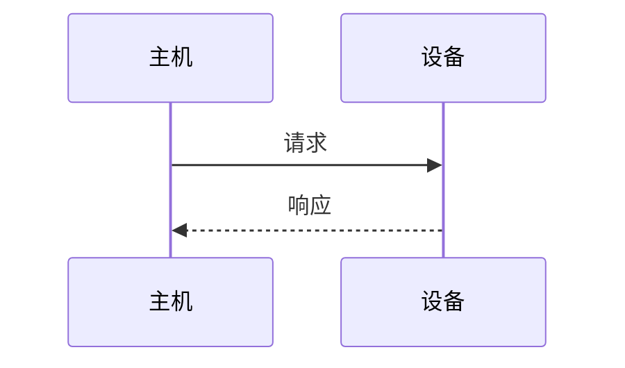

# 功能设计 · <功能名>

**状态**：草案 / 已评审 / 已实现
**提出人**：　　**评审人**：　　**日期**：YYYY-MM-DD
**关联**：spec §x.y ｜ Issue #N

<!--
  存量项目新增功能的入口文档。人工评审通过前不许写代码。
  §3「与现有实现的关系」是本模板存在的主要理由 —— 它是返工代价最高的盲区。
-->

---

## 1. 功能作用

- **解决什么问题**：<现状痛点，最好有具体场景或数据>
- **给谁用**：<使用者 / 调用方>
- **不做什么**：<明确边界，防止范围蔓延>

## 2. 工作逻辑与流程

<用 mermaid 画时序图 / 状态机 / 数据流，配文字说明关键判断分支。>

**关键流程说明**：

1. <触发条件 → 处理 → 输出>
2. <异常路径与恢复策略>

## 3. 与现有实现的关系 ★

| 维度 | 说明 |
|------|------|
| **复用** | <直接调用哪些现有模块/接口，不重复造> |
| **改动** | <要修改哪些文件/接口，是否破坏兼容> |
| **新增** | <新增哪些文件/接口> |
| **竞争** | <与哪些功能争抢资源（CPU/内存/总线/端点/引脚）> |
| **互斥** | <与哪些功能不能同时启用，如何互锁> |
| **回归风险** | <可能被影响的现有功能，需要回归验证哪些用例> |

## 4. 对基准文档的影响

| spec 章节 | 变更内容 | 类型 |
|-----------|----------|------|
| §x.y | | 新增 / 修改 |

- **契约变更**：`docs/spec.contract.toml` 需 <新增/修改> 哪些条目
- **是否需要评审决策**：<是 → 议题是什么；否>

> 实施顺序：**先改 spec 与契约，再写代码**。

## 5. 自动化评估

- **级别**：<🟢 / 🟡 / 🔴>
- **自动部分**：
- **需人工**：

## 6. 验收标准

- [ ] <可判定条件>
- [ ] <回归项：原有 <功能> 不受影响，用 <脚本> 验证>

## 7. 备选方案与取舍

| 方案 | 优点 | 缺点 | 结论 |
|------|------|------|------|
| A（选用） | | | ✅ |
| B | | | 否决，因为… |

---

## 评审意见

| 日期 | 评审人 | 意见 | 处理 |
|------|--------|------|------|
| | | | |
