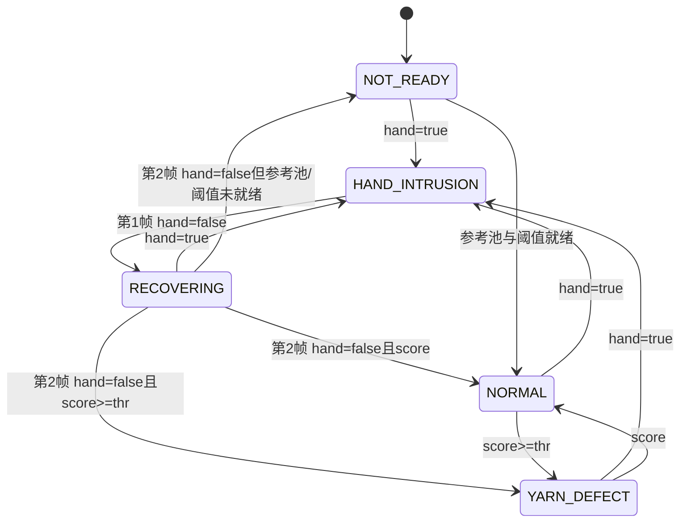

# 功能设计 · 人手入侵与纱线缺陷双状态门控

**状态**：已评审  
**提出人**：用户　**评审人**：用户　**日期**：2026-09-28  
**关联**：spec §4.2–§4.6

## 1. 功能作用

- **解决问题**：人手进入筘齿/纱线检测带时跨帧异常分数很高，可能被误报为纱线缺陷并污染参考池。只在画面边缘出现、未进入检测带的手不定义为本相机的“人手入侵”。
- **给谁用**：Python 离线验证、C# 产线黑纱检测调用方。
- **不做什么**：不新增人手模型；不使用 LAB 规则决定人手；不在人手遮挡时判断纱线缺陷。

## 2. 工作逻辑与流程

1. 调用方先运行现役人手检测，再把布尔值传给黑纱检测器。
2. 人手帧和第一张恢复帧在特征提取前返回，不改变参考池、阈值、分数或框。
3. 连续第二张无人手帧按原算法完整处理并恢复输出。
4. Python 文件回放通过可选 CSV 清单提供 `file,hand_intrusion`；未提供时全部视为无人手，保持兼容。

## 3. 与现有实现的关系

| 维度 | 说明 |
|---|---|
| **复用** | 复用现役人手检测布尔结果、原 DINOv2 特征、阈值和滚动参考池 |
| **改动** | Python 增加状态门控和日志字段；C# 增加兼容重载与状态字段 |
| **新增** | 无模型状态机模块、CSV 事件输入、确定性回归脚本 |
| **竞争** | 门控在推理前返回，不增加 GPU/CPU 推理竞争 |
| **互斥** | `HAND_INTRUSION/RECOVERING` 与纱线报警互斥 |
| **回归风险** | 旧调用路径、恢复计数、参考池更新、日志消费者兼容 |

## 4. 对基准文档的影响

| spec 章节 | 变更内容 | 类型 |
|---|---|---|
| §4.2 | 人手优先门控 | 新增 |
| §4.3 | 两帧恢复 | 新增 |
| §4.4 | 门控帧不入参考池 | 新增 |
| §4.5–4.6 | 状态、接口与日志 | 新增 |

- **契约变更**：新增状态集合、恢复帧数、兼容重载及既有算法常量检查。
- **评审决策**：已由用户批准完整实现计划，无待决项。

## 5. 自动化评估

- **级别**：🟢（状态机和接口）/ 🟡（现役主程序接线与现场效果）
- **自动部分**：状态序列、参考池更新、日志字段、旧路径回归、Python/C# 状态语义一致。
- **需人工**：取得现役系统源码后连接既有人手结果；现场影子模式观察 1–2 个班次。

## 6. 验收标准

- [x] 人手帧状态为 `HAND_INTRUSION`，无纱线报警、分数、阈值和框，参考池不变。
- [x] `有人手→无人手→无人手` 输出 `HAND_INTRUSION→RECOVERING→恢复原算法`（已就绪时为 `NORMAL/YARN_DEFECT`，warm-up 时为 `NOT_READY`）。
- [x] 恢复期间再次有人手会清零计数。
- [x] warm-up 人手帧不占参考池名额。
- [x] 未提供人手事件时，无人手基准结果与原逻辑一致（门控单元和旧两参数接口回归）。
- [x] Python 与 C# 公开状态、恢复规则和兼容行为一致。
- [x] `tools/spec_check.py` 无 FAIL。

## 7. 备选方案与取舍

| 方案 | 优点 | 缺点 | 结论 |
|---|---|---|---|
| 复用现役人手检测做整帧门控 | 语义明确、无额外推理、不会污染参考池 | 需要主工程接线 | ✅ |
| LAB patch 屏蔽 | 已有原型 | 受光照/手套影响，仍会在边缘产生异常 | 否决 |
| 新增 YOLO 人手模型 | 可独立优化 | 需要标注、训练、算力和部署 | 本期不做 |

## 执行记录

- 实现提交：未提交（用户未要求提交）
- 自动化证据：`docs/acceptance-hand-intrusion-gate.md`、`dev_log/hand-intrusion-gate_evidence/`
- Python：8 个状态机测试通过；C#：25 个断言通过；规格契约 15/15 通过
- 现场接线：已定位并接入外部产线工程 `D:\研究生课程\课题\添加按键拍照功能\纱浆检测`
  - `ImageProcessPerson.DetectPerson` 结果写入 `CameraVar.HandIntrusion`
  - 六路 `MainForm` 调用改为先完成人手检测，再调用 `CameraJPGESKCProcess`
  - `CameraJPGESKCProcess` 在 KC 推理前执行两帧恢复门控
- 产线编译：Visual Studio 2022 MSBuild 已完成 Debug/x64 与 Release/x64 Rebuild，均生成 `YarnDectionSys.exe`；仅有既有 `CamreaInitial` 未使用字段警告
- 产线配置：`DetectPerson` 已启用；模型名统一为发布目录实际存在的 `persons.onnx`

## 8. 现役人手模型离线量化（追加评审项）

- 使用产线同一 `persons.onnx` 离线回放，但门控目标**只接受 `hand` 类**；`person / face` 检测不单独触发人手门控。
- 评估清单必须由人工独立填写 `file,hand_intrusion`，不得把模型预测当作真值。
- 输出逐图最高置信度、类别、检测框及汇总混淆矩阵；至少报告 Recall、FPR、Precision、F1，并单列漏检图片。
- 小样本只标记为冒烟结果，不外推为现场泛化结论；正式结论要求覆盖不同相机、远近、肤色/手套、运动模糊及早晚光照。
- 阈值优化只允许在开发集选择，并在独立验证集报告；产线 DLL 阈值若不可配置，不宣称离线阈值已经部署。
- 现役 DLL 只有布尔返回值，必须验证其内部是否过滤为 `hand` 类；未验证前只能称为“模型离线结果”，不能称为“产线 DLL 指标”。
- 实测现役 DLL 会把模型目标折叠为布尔值，无法从接口确认类别和框；因此正式指标按“手是否进入检测带”的人工真值评估，而不是按 ONNX 类别名推断。
- 发布包必须同时包含 `testdll/DetectPerson.dll`、`testdll/persons.onnx` 和其原生依赖 `opencv_world480.dll`；缺一项即不得认为人手门控可部署。
