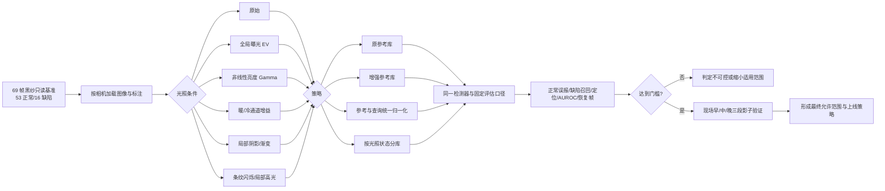

# 功能设计 · 跨帧检测光照鲁棒性量化与参考库增强

**状态**：已实现（合成压力测试）；现场项待补  
**提出人**：用户　**评审人**：用户　**日期**：2026-09-28  
**关联**：拟新增 spec §4.7、§6 光照适用边界与参考库策略

---

## 1. 功能作用

- **解决什么问题**：工厂早晚照度、色温、阴影和灯具闪烁会改变同位置外观；目前只有“跨会期正常带均值异常度 0.23～0.37”的漂移证据，没有正常误报率、缺陷召回、定位率和恢复帧数随光照变化的边界，无法判断风险是否可控。
- **给谁用**：算法验证人员、现场调试人员和产线检测调用方。
- **本步骤目标**：先建立可复现的光照压力测试，比较“不处理、只增强参考库、统一光度归一化、按光照分参考库”四条路线；只有证据达到门槛的方案才进入生产实现。
- **不做什么**：合成调光结果不冒充真实工厂结论；不修改原图和标注；不使用缺陷标签挑选增强参数；不在本设计阶段修改检测源码、spec 或 C# 产线逻辑。

## 2. 工作逻辑与流程

### 2.1 压力变量

所有全局曝光操作在线性 RGB 域完成，避免直接在 8-bit sRGB 上乘系数造成不物理的结论。原图保持只读，扰动图默认不落盘，只保存参数、逐帧结果和少量可视化证据。

| 类别 | 首轮扫描范围 | 含义 |
|---|---|---|
| 曝光 | `-1.5 EV` 到 `+1.5 EV`，步长 `0.25 EV` | 亮度约为原来的 0.35～2.83 倍，裁剪比例单独记录 |
| Gamma | `0.65, 0.8, 1.0, 1.25, 1.5` | 模拟阴影/中间调非线性变化，不与 EV 合并解释 |
| 白平衡 | R/B 通道增益 `0.8～1.25` | 只称“暖/冷偏移”，无相机光谱标定前不伪称具体色温 K |
| 局部阴影 | 强度 `10%～50%`，软边、横向/斜向，3 个固定随机种子 | 模拟手影、灯具遮挡和早晚方向性变化 |
| 条纹闪烁 | 幅度 `5%～30%`，横/竖条纹 | 模拟灯频与滚动快门耦合 |
| 局部高光 | 强度 `10%～50%`，软边椭圆，3 个固定种子 | 模拟金属和纱面反光 |

输出时必须同时给出饱和像素率和暗裁剪像素率；一旦纹理因过曝/欠曝消失，应标记为“成像失效”，不能归咎于检测器。

### 2.2 四组对照

1. **A：原参考库 → 扰动查询帧**：量化早晚光照突变时的瞬时风险。
2. **B：参考库和查询帧同条件变化**：量化在该光照下重新标定后的可达上限。
3. **C：只增强参考库**：正常参考帧生成多档 EV/Gamma/通道增益特征，查询帧不做特殊处理；验证用户提出的“调节样本库图片参数”是否有效。
4. **D：统一预处理或分库**：参考与查询执行相同的亮度归一化，或根据全局亮度/色度选择对应参考库；与 C 比较阈值抬升和算力/内存代价。

缺陷帧绝不进入参考库。所有策略共用同一组图像、标注、检测带、DINOv2、top-1、P99、面积上限和决策阈值规则。

### 2.3 流式恢复测试

构造“稳定原光 → 一步换光 → 新光稳定”的每相机序列，分别测试 `DET_GATED=0/1`。记录：首个误报、连续误报数、参考池恢复到正常的帧数，以及新光下阈值是否仍适用。真实工厂最终按实际处理帧率换算为秒。

### 2.4 异常路径与恢复

- 发生大面积饱和、暗裁剪或全局外观突变时，不应直接输出 `YARN_DEFECT`；候选生产策略是进入 `LIGHTING_CHANGE/RECALIBRATING`，暂停纱线报警并收集确认正常的新参考。
- 局部阴影和高光不能用全局重标定掩盖；若仍形成缺陷样连通块，必须通过照明硬件、独立光照状态门控或真实数据训练解决。
- 人手门控优先级保持不变；本实验不得把人手帧纳入任何光照参考库。

## 3. 与现有实现的关系 ★

| 维度 | 说明 |
|---|---|
| **复用** | `src/black_yarn_detector.py` 的读取、DINOv2 特征、同位置 top-1、P99 连通域评分；`data/gt_清单.csv`/LabelMe 标注；现有 69 帧只读黑纱基准 |
| **改动** | 设计批准后仅把通用光度变换/归一化入口接入 Python 实验；是否进入部署脚本和 C# 由实验结果另行决定，不预先修改生产默认值 |
| **新增** | `src/illumination_stress_eval.py`；`tools/test_photometric_transforms.py`；`data/illumination_stress_results.csv/json`；`dev_log/illumination_robustness_evidence/`；验收报告 |
| **竞争** | 增强参考库会线性增加特征提取时间、内存与 top-1 比较量；C# 当前每相机参考池 8 帧，不能直接塞入全部增强版本 |
| **互斥** | 光照参考库只接收无人手且确认正常帧；`HAND_INTRUSION/RECOVERING` 期间禁止更新；合成增强不得与原始图共同参与测试阈值拟合造成数据泄漏 |
| **回归风险** | 增强参考会降低正常异常度，但也可能让真实缺陷找到“伪相似参考”导致漏检；增加正常变化会抬高阈值；归一化可能削弱暗斑类真缺陷；不同策略会改变 Python/C# 一致性 |

## 4. 对基准文档的影响

设计批准后、实施代码前更新：

| spec 章节 | 变更内容 | 类型 |
|---|---|---|
| §3 | 明确光度预处理、参考库结构和阈值是否按光照状态独立 | 视实验胜出方案修改 |
| §4.7 | 新增光照适用边界、突变识别、报警抑制与恢复规则 | 新增 |
| §6 | 新增光照阈值、参考库档位、恢复帧数配置 | 新增 |
| §7 | 声明合成测试与真实现场证据的边界 | 修改 |

- **契约变更**：实施胜出策略时，`docs/spec.contract.toml` 增加默认开关、允许范围、参考库上限、状态/恢复行为和 Python/C# 一致性检查。
- **需要评审决策**：本实验先以“正常误报不高于 5%、缺陷召回最多下降 1/16、定位不少于 14/16”为可控门槛；现场是否接受 5% 帧级误报仍需结合报警去抖策略确认。

## 5. 自动化评估

- **级别**：🟡。合成压力测试、指标和回归可全自动；真实工厂早/中/晚采集需要一次人工布置与确认无缺陷段。
- **自动部分**：确定性图像变换、特征缓存、四策略对照、指标计算、边界搜索、曲线和证据报告、原始基线回归。
- **需人工**：每路相机在早/中/晚各采集至少 60 张确认正常帧和尽可能相同类型的缺陷帧；记录相机曝光/增益/白平衡、灯具状态和可选照度计读数。若相机自动参数开启，还需导出逐帧参数。
- **自动化升级路径**：在产线影子模式记录全局亮度/色度、相机参数、检测分数和状态，连续覆盖至少两个完整班次。

## 6. 验收标准

### 6.1 实验正确性

- [x] 原始 0 EV 条件复跑并作为本实验基线；因生产口径要求参考库只含正常帧，与历史“其他全部帧作参考”的论文基准分开报告。
- [x] 图像变换单元测试覆盖恒等变换、EV 线性倍率、Gamma、通道增益、阴影、闪烁和高光。
- [x] 数据清单证明参考库仅含正常帧；正常查询排除自己的变体，缺陷帧不入参考库。
- [x] 每个结果记录变换参数、饱和/暗裁剪比例、策略、相机、标签、分数、阈值、报警和定位命中。

### 6.2 “可控范围”判据

- [x] 自动输出每种策略的最大连续安全 EV 区间；主结果按14缺陷等比例要求定位至少13/14。
- [x] Gamma、暖/冷偏移、局部阴影、闪烁和高光分别输出第一个越界档位，并同时报告误报、召回、定位和 AUROC。
- [ ] 流式突变 P50/P95：现有离散基准不足以构造不重复长流，待连续产线录像。
- [x] 对小样本误报/召回给 Wilson 95% 置信区间，并声明主结果单个缺陷翻转为7.14个百分点。

### 6.3 样本库增强是否成立

- [ ] 严格连续边界未向亮侧扩展满0.5 EV：+0.5 EV定位降为12/14；分类报警虽在±1.5 EV稳定，仍判为未完全达标。
- [x] 未扰动原始条件保持2/48误报、13/14召回、13/14定位。
- [x] 报告特征内存与实测GPU单帧提取时间；C#资源待方案确定后测量。
- [x] 同时比较同条件重标定；它在小标定集上常增加误报，未通过抬阈值掩盖召回。

### 6.4 真实现场闭环

- [ ] 早/中/晚真实正常帧：待现场采集，每路每时段至少60张。
- [ ] 真实缺陷召回和定位：未验收，待冻结参数影子模式积累。
- [x] 合成结果明确标为预筛选，不写成真实lux/色温允许范围。

### 6.5 统一检测与定位指标（2026-09-29追加、用户已批准）

- [x] 从逐帧结果统一计算 FPR、Recall、Precision、AUROC，并给 FPR/Recall/Precision 的 Wilson 95% 置信区间。
- [x] 从原始 LabelMe 标注回填 GT 框，计算预测框最佳 IoU、IoU 中位数，以及 IoU≥0.1/0.3/0.5 的框级召回。
- [x] 同时报告“报警且定位点进入人工框”的缺陷成功率，以及它占全部报警的比例。
- [x] 每小时误报警次数只有在调用方提供连续观测时长或固定帧周期时输出；当前离散基准正确输出 `null` 和不可计算原因。
- [x] 用确定性小样本夹具验证混淆矩阵、Precision、IoU、联合成功率和每小时误报公式（24项断言通过）。

## 7. 备选方案与取舍

| 方案 | 优点 | 缺点 | 结论 |
|---|---|---|---|
| A. 只增强参考库图片 | 最贴合现有 top-1 机制，不训练模型 | 占用参考位和算力，可能让缺陷找到伪相似参考；阈值也可能升高 | 必测，但不预设为最终方案 |
| B. 参考和查询统一光度归一化 | 内存不增加，可持续处理渐变 | 可能改变缺陷对比度；C# 需完全一致实现 | 与 A 同级对照 |
| C. 早/晚分参考库并按光照状态选择 | 不把不相容分布硬混在一起，阈值可独立 | 需要可靠的光照状态判定和现场标定 | 当前最可能的生产方案 |
| D. 每次换光自动重建单一参考库 | 逻辑简单 | 恢复期无检测，若误把缺陷收入池会失效 | 作为兜底恢复方案 |
| E. 仅调高报警阈值 | 实现最简单 | 会直接牺牲缺陷召回，无法处理局部阴影 | 否决 |

---

## 评审意见

| 日期 | 评审人 | 意见 | 处理 |
|---|---|---|---|
| 2026-09-28 | 用户 | 按设计运行测试，重点量化模型泛化性与性能边界 | 已批准进入实施 |
| 2026-09-29 | 用户 | 补齐检测、定位及每小时误报警统一量化 | 已批准实施；连续时长缺失时必须明确不可用 |

## 执行记录

- 实现：`src/illumination_stress_eval.py`、`tools/test_photometric_transforms.py`、`tools/summarize_illumination_results.py`、`tools/plot_illumination_results.py`
- 统一指标：`tools/evaluate_detection_metrics.py`、`tools/test_detection_metrics.py`
- 证据：`dev_log/illumination_robustness_evidence/`、`dev_log/illumination_robustness_other_evidence/`、`dev_log/illumination_robustness_final/`
- 验收报告：`docs/acceptance-illumination-robustness.md`
- 指标报告：`docs/acceptance-detection-metrics.md`、`dev_log/detection_metrics_evidence/current_baseline/`
- 生产实现：未改动；严格参考增强门槛未完全通过，且真实现场数据尚缺。
