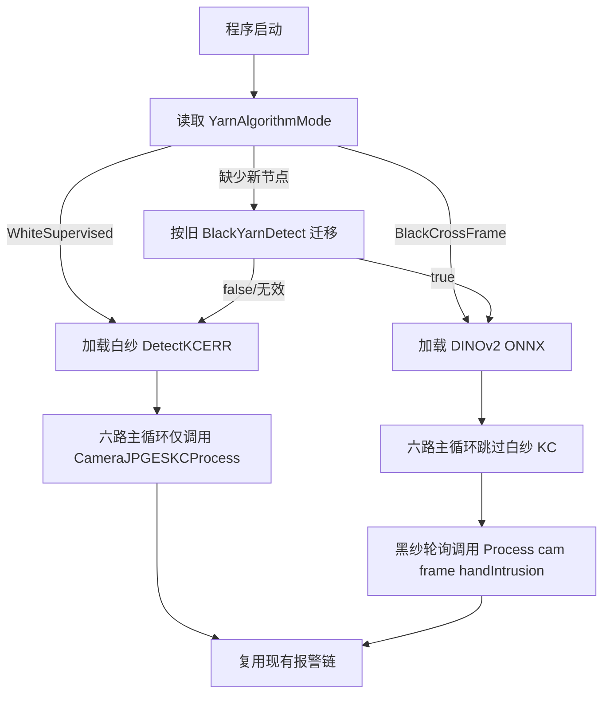
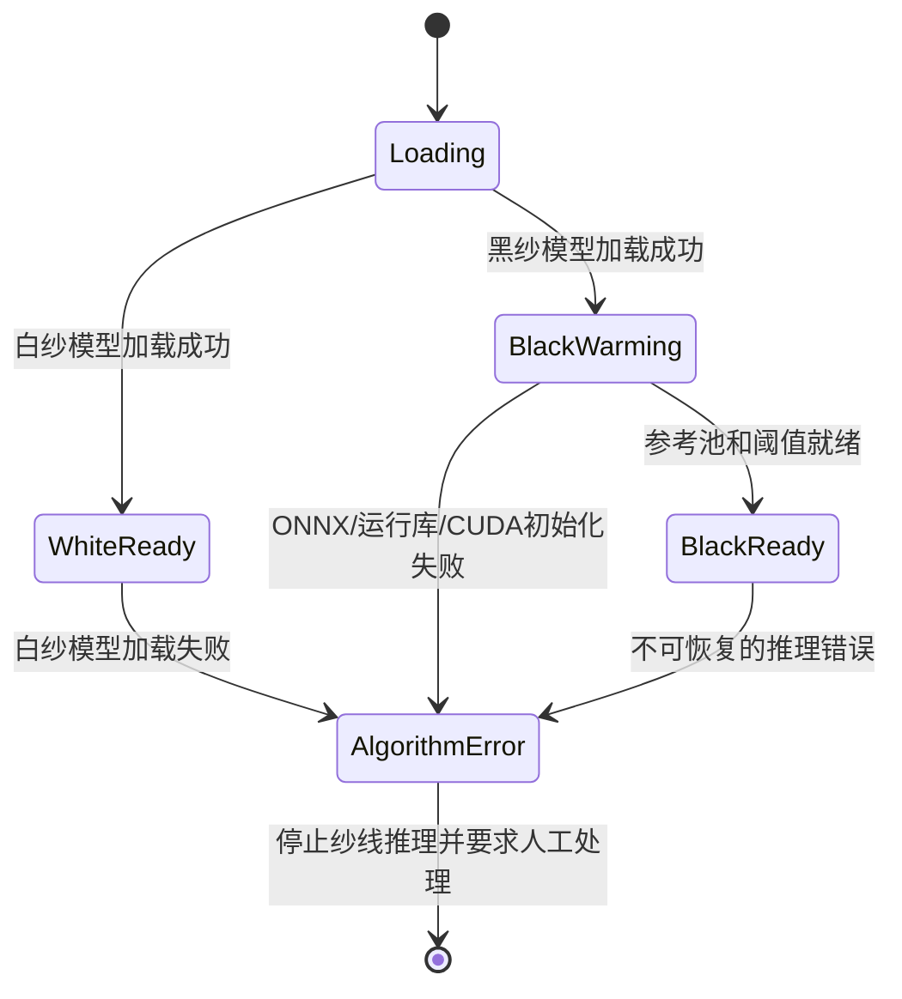

# 功能设计 · 上位机白纱/黑纱算法选择

**状态**：已实施，待产线硬件验收  
**提出人**：用户　**评审人**：用户　**日期**：2026-09-29  
**关联**：`docs/spec.md` §1、§4、§5、§6、§8

---

## 1. 功能作用

- **解决什么问题**：现役 WinForms 上位机的白纱监督检测 `DetectKCERR` 始终由六路主循环调用，黑纱 DINOv2 跨帧检测由独立定时器附加启用。当前“黑纱检测开/关”不是算法二选一，开启后两个算法可能同时运行，产生重复报警、错误语义和 CPU/GPU 资源竞争。
- **给谁用**：浆纱机现场操作员和调试人员。操作员根据当前整批纱线类型，在参数设置界面选择“白纱算法”或“黑纱/深色纱算法”。
- **本功能目标**：提供一个全局、互斥、可持久化、可见的算法选择，保证任何时刻只执行一种纱线缺陷算法；人手检测与算法选择解耦，在两种模式下继续工作。
- **不做什么**：首版不根据图像颜色自动切换；不允许生产运行中热切换；不同时融合两个算法结果；不修改两个算法内部阈值、模型和评价口径；不改变现有人手报警、铃、灯、减速、SQLite和存图链路。

## 2. 工作逻辑与流程

### 2.1 模式定义

新增配置枚举 `YarnAlgorithmMode`：

| 配置值 | 界面文字 | 执行算法 |
|---|---|---|
| `WhiteSupervised` | 白纱算法（YOLO监督检测） | `DetectKCERR.dll` / `ImageProcessKC.DetectKC` |
| `BlackCrossFrame` | 黑纱/深色纱算法（跨帧参考） | `BlackYarnDetector.Process` |

模式为上位机全局设置，覆盖同一批纱线的全部在线相机。黑纱模式继续保留 `BlackYarnCameras` 作为分阶段上线范围；未列入该范围的相机必须在界面显示“黑纱检测未启用”，不得静默回退白纱算法。

### 2.2 界面

在 `ParamaConfigSettings` 中将现有“黑纱/深色纱检测”分组改为“纱线检测算法”：

1. `ComboBox` 使用 `DropDownList`，只允许选择上述两个枚举值；
2. 选择白纱算法时，禁用并灰显黑纱 GPU、轮询间隔、启用相机等控件；
3. 选择黑纱算法时，启用黑纱专属控件；
4. 参数窗口明确显示“算法切换将在重启软件后生效”；
5. 主界面增加只读状态文字：`当前纱线算法：白纱`或`当前纱线算法：黑纱/深色纱`；
6. 黑纱模式处于 `NOT_READY/RECOVERING` 时，在主界面显示准备状态，不能伪装成“正常”。

### 2.3 启动与路由



关键规则：

1. 程序启动时只初始化所选算法所需的模型和调度器。
2. 白纱模式下不得创建黑纱 `InferenceSession`，不得启动 `blackYarnTimer`。
3. 黑纱模式下六路任务仍可运行取图与人手检测，但必须跳过 `CameraJPGESKCProcess`，不得调用 `DetectKCERR.dll` 推理。
4. 黑纱检测必须调用带人手参数的 `Process(cameraIndex, frame, cameraVar.HandIntrusion)`，保留 `HAND_INTRUSION/RECOVERING` 语义。
5. 两种算法命中后均复用现有 `cameraVar.Ring`、铃、灯、减速、SQLite和异步存图链路；日志中的算法名和故障类型必须可区分。
6. 切换模式只允许在设备检测停止状态修改。保存后提示重启；本期不在同一进程内卸载和重新加载模型。

### 2.4 配置兼容

在 `System.ParamConfig.xml` 增加：

```xml
<YarnAlgorithmMode>WhiteSupervised</YarnAlgorithmMode>
```

兼容旧配置：

1. 有 `YarnAlgorithmMode` 时，以新节点为唯一选择；
2. 没有新节点但 `BlackYarnDetect=true` 时，迁移为 `BlackCrossFrame`；
3. 没有新节点且 `BlackYarnDetect=false`、缺失或无效时，使用 `WhiteSupervised`，保持原系统行为；
4. 首版保存时同时更新旧 `BlackYarnDetect`：黑纱模式写 `true`，白纱模式写 `false`，便于旧版本回退；
5. 读取到未知枚举值时不猜测为黑纱，记录配置错误并回退 `WhiteSupervised`。

### 2.5 异常与恢复



- 模型加载失败时禁止静默改用另一种算法，因为对白纱使用黑纱策略或对黑纱使用白纱策略都可能形成危险漏检。
- 失败后保留取流和人手检测，但关闭纱线报警，主界面显示红色 `纱线算法加载失败`，同时写入文件日志和SQLite系统日志。
- 黑纱CUDA初始化失败是否允许回退CPU，沿用现有 `BlackYarnDetector` 规则，但必须在界面显示实际后端，并记录性能降级；不得把CPU回退误报为完整GPU运行。
- 软件重启后根据已保存模式重新初始化；切到黑纱模式必须从空参考池重新warm-up，不能复用上次进程中的参考状态。

## 3. 与现有实现的关系

| 维度 | 说明 |
|---|---|
| **复用** | 复用 `ParamaConfigSettings` XML读写、现有白纱 `ImageProcessKC.DetectKC`、黑纱 `BlackYarnDetector`、人手 `CameraJPGESPersonProcess`、`CameraVar.HandIntrusion`、六路取图、报警、SQLite和存图链路 |
| **改动** | `ParamaConfigSettings.cs/.Designer.cs/.resx` 增加模式选择并替代“黑纱开关”语义；`MainForm.cs` 启动时按模式初始化并在六路调用点互斥路由；`System.ParamConfig.xml` 增加枚举节点；主界面增加当前模式/准备状态显示 |
| **新增** | 建议新增无UI依赖的 `YarnAlgorithmMode` 枚举和纯路由/解析类，供配置、主程序和自动测试共享；增加配置迁移与路由测试 |
| **竞争** | 当前两个算法可能同时运行并争用CPU/GPU；改为互斥后应减少资源竞争。黑纱轮询仍与取流、人手检测和UI共享线程池，必须保留防重入 |
| **互斥** | `WhiteSupervised` 与 `BlackCrossFrame` 严格互斥；算法切换与生产运行互斥；人手检测不互斥，并且在人手入侵时优先门控黑纱算法 |
| **回归风险** | 六处白纱调用点漏加路由会造成双算法并跑；旧XML解析失败可能改变默认模式；黑纱模式若仍初始化白纱DLL会浪费资源；配置窗口控件重排可能再次发生遮挡；错误回退可能在错误纱色上运行错误算法 |

当前代码事实：

- 白纱算法在 `MainForm.cs` 六路 `CameraJPGESKCProcess(...)` 调用点执行；
- 黑纱算法由 `blackYarnTimer` / `BlackYarnTick` 独立执行；
- 当前 `BlackYarnDetect` 只是附加开关，开启后不会自动阻止白纱算法；
- 当前黑纱配置界面已有开关、CUDA、轮询间隔和相机范围，可复用布局但需改成真正的模式选择。

实施目标工程为：

- **统一生产基线**：`D:/研究生课程/课题/色纱研究/浆纱检测系统/YarnDection/`。该目录已有Git历史、黑纱算法、黑纱设置界面、授权与自检工具，作为合并目标。
- **待合入的人手门控来源**：`D:/研究生课程/课题/添加按键拍照功能/纱浆检测/YarnDection/`。从该目录迁入最新 `HandIntrusionGate.cs`、`CameraVar` 状态、先做人手检测再门控纱线检测的调用顺序、配置和构建依赖。
- 算法规格与独立实现：本仓库 `CrossFrame-Yarn-Anomaly/`

用户已确认两部分必须合并为同一个上位机，不再允许分别演进。合并时必须以功能为单位做语义合并，禁止直接用一份 `MainForm.cs` 覆盖另一份：两边的 `MainForm.cs` 已有约 988 行差异，整体覆盖会丢失黑纱调度、性能修复、人手门控或新增拍照功能。

### 3.1 合并范围与顺序

统一上位机最终必须同时保留：

1. 原白纱 `DetectKCERR` 监督检测；
2. 黑纱 `BlackYarnDetector`、ONNX加载、轮询、防重入、独立存图与自检；
3. 人手 `DetectPerson.dll` 和 `HandIntrusionGate`，并按“先人手、后纱线”路由；
4. 原有六路取流、拍照按钮、性能与内存修复；
5. 授权密钥外置、SQLite、铃、灯、减速和配置窗口；
6. 本文设计的白纱/黑纱互斥选择器。

建议合并顺序：

1. 先处理 `浆纱检测系统` 本地分支与远端各12个提交的分叉，保存可恢复分支，不覆盖任何一边；
2. 在统一生产基线上建立功能分支；
3. 移入人手门控独立类及其无模型测试；
4. 逐段合并 `CameraVar.cs` 与 `MainForm.cs` 的人手状态和调用顺序；
5. 合并项目文件与发布依赖，保证 `DetectPerson.dll`、`persons.onnx`、`opencv_world480.dll` 随构建复制；
6. 在人手门控回归通过后，再实现算法选择路由；
7. 最后合并或核验拍照按钮等外部工程独有功能，执行Debug/Release完整重建和六路人工验收。

## 4. 对基准文档的影响

评审通过后，先修改 `docs/spec.md`：

| spec章节 | 变更内容 | 类型 |
|---|---|---|
| §1 系统架构 | 在人手门控和两种纱线算法前增加全局算法路由器 | 修改 |
| §4.1 纱线异常检测 | 分别定义白纱与黑纱模式，明确互斥调用 | 修改 |
| §4.5 对外状态与兼容 | 增加当前算法模式和算法加载失败状态 | 修改 |
| §4.6 日志和可视化 | 日志、主界面和存图标明算法来源 | 修改 |
| 新增 §4.9 | 算法选择、停机切换、重启生效、旧配置迁移和禁止静默回退 | 新增 |
| §5 软件架构 | 增加设置窗体、算法路由和六路调用点 | 修改 |
| §6 配置项 | 新增 `YarnAlgorithmMode`，将 `BlackYarnDetect` 标为兼容节点 | 修改 |
| §8 评审决策 | 记录全局选择、切换时机、默认模式和错误策略 | 新增 |

`docs/spec.contract.toml` 建议增加以下自动检查：

- `config.yarn_algorithm_modes`：只允许 `WhiteSupervised/BlackCrossFrame`；
- `config.legacy_black_yarn_migration`：旧 `BlackYarnDetect` 有明确迁移；
- `routing.white_excludes_black`：白纱模式不启动黑纱定时器；
- `routing.black_excludes_white`：黑纱模式不调用 `CameraJPGESKCProcess`；
- `routing.hand_detection_preserved`：两种模式均保留人手检测；
- `routing.black_passes_hand_state`：黑纱调用传入 `HandIntrusion`；
- `ui.mode_is_visible`：参数窗体和主界面均显示模式；
- `failure.no_cross_algorithm_fallback`：模型失败不静默切换算法。

已确认决策：

1. 黑纱算法和最新人手门控必须合并到同一个C#上位机，不能维持两个分叉产品。
2. 以Git管理的 `色纱研究/浆纱检测系统` 作为统一生产基线，另一目录作为功能来源，采用语义合并而非整文件覆盖。

实施默认值（用户要求“先合并再实施”，按推荐方案执行）：

1. 算法选择按整台设备全局生效，因为六路相机观察同一批纱线。
2. 首版采用“停机修改、保存后重启生效”，不实现运行中卸载和重载模型。
3. 黑纱模式默认覆盖全部六路；`BlackYarnCameras` 仅保留给分阶段影子验证。

## 5. 自动化评估

- **级别**：🟡。配置解析、路由互斥、构建和日志可自动化；WinForms布局、真实模型加载和六路现场切换需要人工验收。
- **自动部分**：
  - 新旧XML配置解析与迁移；
  - 未知配置值回退白纱并记录错误；
  - 用假白纱/黑纱执行器计数，证明任一帧只调用一种算法；
  - 黑纱路由透传 `HandIntrusion`；
  - 白纱模式不创建黑纱计时器，黑纱模式不调用白纱KC；
  - Debug/x64和Release/x64完整重建；
  - 旧配置文件启动回归。
- **需人工**：
  - 参数窗口无重叠，选项、灰显和说明清晰；
  - 主界面实际模式与配置一致；
  - 白纱实拍只产生白纱算法日志，黑纱实拍只产生黑纱算法日志；
  - 黑纱模式观察warm-up、正常、手入侵和恢复状态；
  - 拔掉对应模型文件，确认不会静默运行另一算法。
- **自动化升级路径**：把模式解析与互斥路由提取成无WinForms依赖类，并通过假执行器做持续集成；对主界面只保留一次人工视觉检查。

## 6. 验收标准

- [x] 参数设置界面只能选择“白纱算法”或“黑纱/深色纱算法”，不能同时勾选。（代码与构建验收）
- [x] 选择结果写入 `YarnAlgorithmMode`，重启后保持一致；旧配置按照 §2.4 正确迁移。（15项无模型断言）
- [x] 白纱模式下只初始化和路由白纱KC，黑纱 `InferenceSession` 和定时器不创建。（静态路由与构建验收；真实模型待现场）
- [x] 黑纱模式下六路白纱KC路由关闭，只创建黑纱轮询。（静态路由与构建验收；真实模型待现场）
- [x] 两种模式下均保留人手路径；黑纱入口收到人手布尔值并通过两帧恢复门控。（无模型门控断言）
- [x] 主界面标题始终显示当前生效模式；保存不同算法但不重启时显示“算法变更待重启”。
- [x] 黑纱模式在标题栏显示启用相机的 `NOT_READY/RECOVERING` 汇总、实际 CPU/CUDA 后端和未启用相机数。
- [x] 任一算法模型加载失败时，另一算法不会自动接管；界面、文件日志和系统日志均报告错误。（异常分支代码与构建验收）
- [ ] 白纱报警继续存入原目录，黑纱报警继续存入 `ErrBlack/`，SQLite记录可区分算法来源。
- [ ] 切换模式不改变铃、灯、减速和相机取流逻辑。
- [x] Debug/x64与Release/x64重建通过，除4个既有 `CamreaInitial` 警告外无新增编译警告。
- [ ] 连续运行至少2小时，进程内存无持续增长，六路取流和UI无卡死。

## 7. 备选方案与取舍

| 方案 | 优点 | 缺点 | 结论 |
|---|---|---|---|
| A. 全局二选一，停机设置，重启生效 | 改动边界清楚、最安全、无热切换资源泄漏；符合一批纱线同一颜色的现场流程 | 切换需要重启软件 | ✅ 首版推荐 |
| B. 全局二选一，停机后立即热切换 | 操作更快 | 需安全卸载ONNX、DLL对象和计时器，跨线程状态复杂，回归风险高 | 后续版本再做 |
| C. 每相机独立选择算法 | 可处理混合机位和分阶段试验 | UI和配置复杂，可能同机混用错误算法，资源峰值更高 | 不作为生产首版；影子测试用相机范围代替 |
| D. 两算法同时运行并合并结果 | 可做研究对比 | 计算量、误报和报警归因复杂，违背用户的“选择”目标 | 否决 |
| E. 自动识别纱色后切换 | 操作简单 | 识别错误会选错算法，缺少可靠纱色分类证据 | 否决 |

---

## 评审意见

| 日期 | 评审人 | 意见 | 处理 |
|---|---|---|---|
| 2026-09-29 | 用户 | 按推荐的全局互斥、停机设置、重启生效、黑纱默认六路方案实施 | 已批准进入实施 |
| 2026-09-29 | 用户 | 黑纱算法工程与最新人手门控工程应合并到一起 | 已纳入统一生产基线和分阶段语义合并方案 |

## 实施记录（2026-09-29）

- 已在统一生产基线 `浆纱检测系统` 的 `feat/yarn-algorithm-selection` 分支完成语义合并；未改写本地与远端各 12 个提交的分叉历史。
- 已进一步核验该“12 对 12”分叉：两边没有共同祖先，但 12 组提交补丁等价，`main` 与 `origin/main` 的树对象均为 `2e9734931fb5771b1bd9e8247c71fb09741c2f6d`。因此使用 `ours` 策略只连接两条历史，生成合并提交 `6731ef8`；功能分支合并前后树对象均为 `6d68cd055a5b5892ac894796af46e830e65878c6`，代码内容未改变。
- 已合入 `HandIntrusionGate`、每相机人手状态、同帧“先人手后纱线”顺序，以及黑纱 `Process(cam, frame, handIntrusion)` 门控。
- 已新增 `YarnAlgorithmMode` 配置迁移和互斥路由；设置窗体只允许白纱/黑纱二选一，黑纱专属控件随选择灰显，主窗体标题显示生效模式。
- 已保留并合入 DI2 六路并发拍照：后台轮询、上升沿、2 秒防抖、共享码流安全克隆和 `MisreportPhoto` 存图。
- 自动验证：路由/迁移/门控 15 个断言通过；规格契约 0 FAIL；Debug|x64 与 Release|x64 均 0 error（各 4 个既有 `CamreaInitial` 警告）。
- 尚需现场完成：真实 DLL/ONNX 加载、两种纱色切换、六路 DI2 拍照、人手入侵/恢复、铃灯减速链与至少 2 小时稳定性测试。
- 2026-09-30 补齐无硬件可验收项：检测运行中禁止打开参数编辑；参数窗体每次新建，避免关闭后复用已释放窗体；主标题显示当前模式、黑纱后端、预热/人手/恢复/异常/未启用计数和待重启状态；模型失败同步写 SQLite 系统日志。
- 两个功能分支已推送到各自私有远端；未修改远端 `main`。
